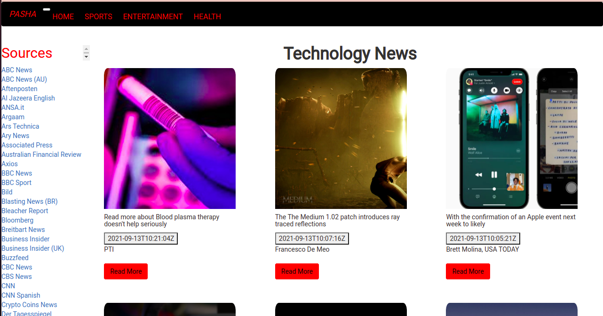
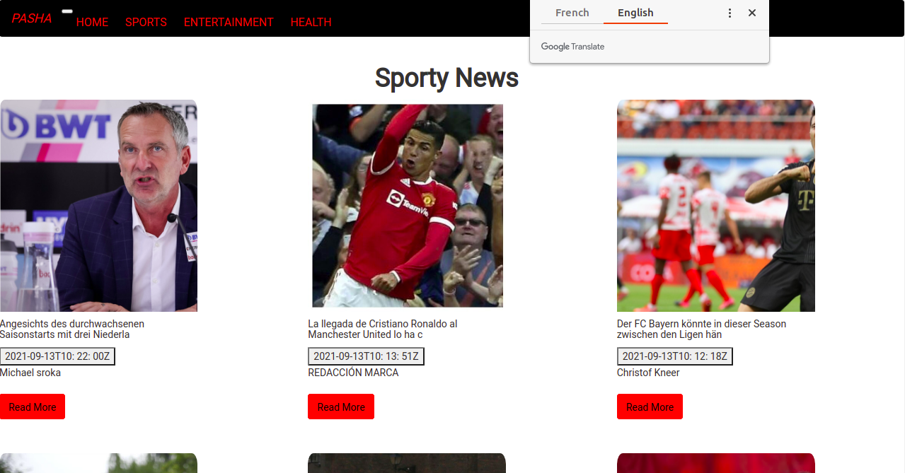
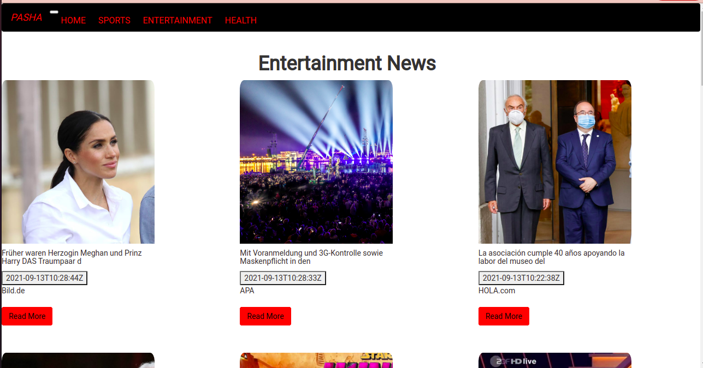
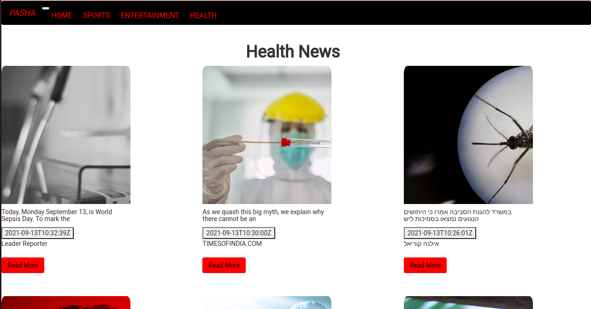

# Pasha
# Build by Laurette
## Live link 
https://pasha-news.herokuapp.com/

## DESCRIPTION
Pasha is a news web application where user can access news from different sources such as BBC and Aljazeera or access articles depending on categories.It consumes News api using an api_key to achieve this.

## User Stories
These are the behaviours/features that the application implements for use by a user.

<ul>
<li>As a user,I would like to see various news sources on the homepage of the application.</li>
<li>As a user, I would also want to select a news source and see all news articles from the selected news source in the application.</li>
<li>As a user, I would want to see the image, description and the time a news article was created.</li>
<li>As a user, I would want to click on an article and read the full article on the source website.</li>

## Setup Installation

### Requirements
<ul>
<li>Python 3.8</li>
<li>Pyperclip</li>
<li>Pip</li>
<li>Flask 1.1.4</li>
<li>News api_key(https://newsapi.org/)</li>
</ul>

### Cloning

<ul>
<li>Open the terminal</li>
<li>git clone https://github.com/LauretteMongina/Pasha.git</li>
</ul>

### Running Application
Open cloned folder in terminal
  Run these commands:
  <ul>
   <li>$ python3.8 -m venv --without-pip virtual</li>
   <li>$ source virtual/bin/activate</li>
   <li>chmod a+x start.sh</li>
   <li>$ ./start.sh</li>
   <li>Open browser and navigate to http://127.0.0.1:5000/ to view application</li>
   </ul>

### Testing 
  Run $python3.8 manage.py test

## Technologies Used
<ol>
<li>python3.8</li>

## Known Bugs
There are no known bugs in the application

## Contact Information
If you have any questions, reach out to me via monginalaurette@gmail.com

## License
MIT license

Copyright(c)2021 Laurette Mong'ina.

